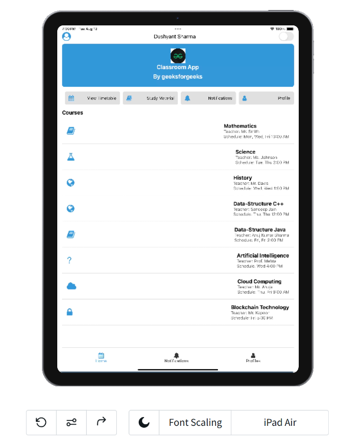
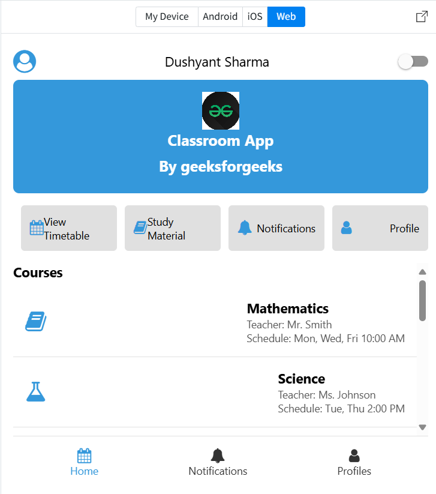

# Classroom App

A React Native mobile application that helps students manage their courses, timetable, study materials, notifications, and profiles. The app supports light and dark modes for better usability in different lighting environments.

## Features

- View list of courses with details (teacher, schedule, icon)
- View class timetable
- Access study materials with external links
- View notifications
- View profiles of students
- Toggle between light and dark mode UI themes

## Screenshots

Add your screenshot PNGs to the assets folder with these filenames (or adjust paths below if different). Each image is referenced relatively so it renders on GitHub.

### iPhone 15 Pro   


### Pixel 7  


### iPad  


### Web    


- 

> If your existing files are named differently (e.g., `assets/Iphone 15 Pro.png`, `assets/Pixel 7.png`, `assets/iPad.png`, `assets/Web.png`), either rename them to match the above or update the image paths accordingly.  
> To keep the README compact, consider using a single “light” screenshot per platform if preferred.

## Installation & Setup

1. Make sure you have Node.js and React Native CLI installed.  
2. Clone this repository:  
```bash
git clone https://github.com/Dushyantsharmma/ClassRoom-App.git
cd ClassRoom-App


3. Install dependencies:

```bash
npm install
```

or if you use yarn:

```bash
yarn install
```

4. Run the app on your simulator or device:

```bash
npx react-native run-android
# or
npx react-native run-ios
```

> Note: For iOS, you need a Mac with Xcode installed.

## Usage

* Use the toggle switch on the top right to switch between light and dark modes.
* Navigate between Home, Timetable, Study Material, Notifications, and Profile screens using buttons or bottom navigation.
* Tap on study material links to open them in the browser.

## Technologies Used

* React Native
* react-native-vector-icons (FontAwesome)
* React Hooks (`useState`, `useEffect`)
* React Native components: `FlatList`, `ScrollView`, `TouchableOpacity`, `Switch`, `Image`

## Live Demo

You can try out a live, interactive version of the Classroom App on [Expo Snack](https://snack.expo.dev/@trippin/classroom-app). This lets you run the app directly in your browser or on your device using the Expo Go app without any local setup.

[Open Classroom App on Expo Snack](https://snack.expo.dev/@trippin/classroom-app)

## Contributing

Feel free to fork the repo, create issues, or submit pull requests to improve the app.

## License

This project is open source and available under the MIT License.

---
